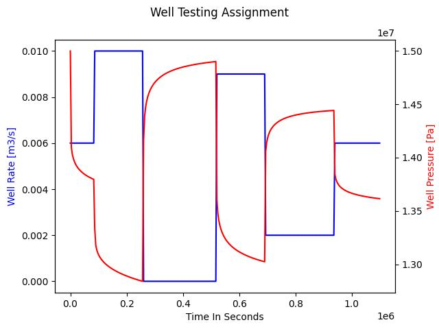

# Multi Rate Well Testing 

Develop a simulator in Python 3 where: 
1. The rate and duration of production of a well are given as an input
2. The plot of reservoir pressure and rate at well location versus time are provided as the output.

Take the parameters provided in [the example input](inputs/test_input.yml) (eg. reservoir initial condition, permeability, etc.) as inputs for the simulator. During your well test, **5 DIFFERENT FLOW RATES** should be used for different periods of time. Create a YAML input parser for the inputs provided and the flow rates so that they can be varied by the user, this may also include more than 5 different rates or periods.

The transient solution for a drawdown test can be represented by the following equation:

It will be helpful to remember the superposition principle for this exercise

The results should look somewhat similar to the plot below:

