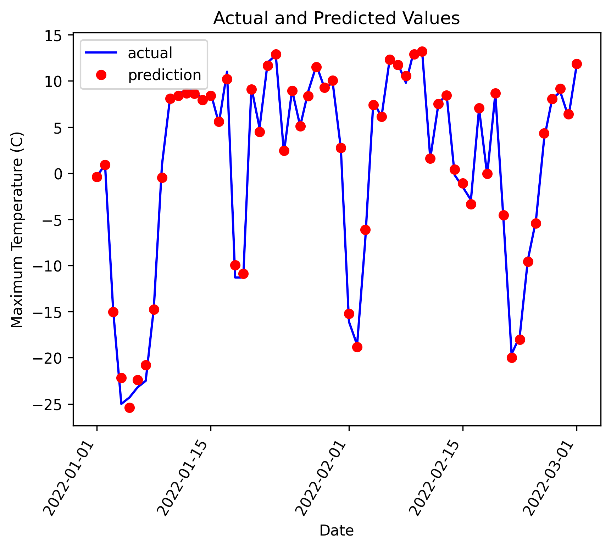
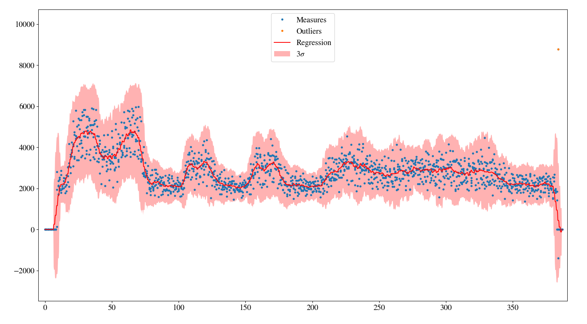

# Introductory ML Problem Set - Assignment #2

Most of this tutorial/problem set was pulled from https://towardsdatascience.com/random-forest-in-python-24d0893d51c0, in order to facilitate the coding yourself, you will be asked to use the CatBoost Python library for the model (https://github.com/catboost/tutorials/).

## Problem Introduction
The problem we will tackle is predicting the max temperature for tomorrow in our city using one year of past weather data. We are going to act as if we don’t have access to any weather forecasts (and besides, it’s more fun to make our own predictions rather than rely on others). What we do have access to is one year of historical max temperatures. This is a supervised, regression machine learning problem. It’s supervised because we have both the features (data for the city) and the targets (temperature) that we want to predict. During training, we give the random forest both the features and targets and it must learn how to map the data to a prediction. Moreover, this is a regression task because the target value is continuous (as opposed to discrete classes in classification). 

To Summarize, our Features list is as follows:
1. Date
2. Min Temp
3. Mean Temp
4. Total Precipitation
5. Snow on Ground
6. Not included in the CSV files, but please use the max temperature of the previous day as another feature

Target should be:
1. Max Temp of the current day

## Data Acquisition
The data we will be using can be found on the weather canada website (https://climate.weather.gc.ca/index_e.html). We will be using 2010-2021 data to train the model and the first part of 2022 to verify our predictions.

We will be using the maximum temperature in degrees celsius to predict the maximum temperatures for 2022. The start of this project with a web scraper has been initialized in [the weather_predictor folder](weather_predictor/data/DownloadWeatherData.py). 

Please use the DownloadWeatherData class to scrape the weather canada data. The class and functions have been setup so that you don't need to change any of the inputs for this assignment.

Note that there may be days with missing data and 2020 was a leap year. I would suggest using Panda’s csv reader to parse the csv files, but you can proceed however you would like.

## Data Preparation
Unfortunately, we aren’t quite at the point where you can just feed raw data into a model and have it return an answer (although people are working on this)! We will need to do some minor modification to put our data into machine-understandable terms. We will use the Python library Pandas for our data manipulation relying, on the structure known as a dataframe, which is basically an excel spreadsheet with rows and columns.

The exact steps for preparation of the data will depend on the model used and the data gathered, but some amount of data manipulation will be required for any machine learning application. You will want to search for things like blank entries, large number deviations and missing dates. A good way to do some of this work is to plot the data (or a subset of data), it will also help you understand what is located where. I generally use matplotlib in python.

## Features and Targets and Convert Data to Arrays
Now, we need to separate the data into the features and targets. The target, also known as the label, is the value we want to predict, in this case the actual max temperature and the features are all the columns the model uses to make a prediction. We will also convert the Pandas dataframes to Numpy arrays because that is the way the CatBoost works. (I save the column headers, which are the names of the features, to a list to use for later visualization).

## Training and Testing Sets
There is one final step of data preparation: splitting data into training and testing sets. During training, we let the model ‘see’ the answers, in this case the actual temperature, so it can learn how to predict the temperature from the features. We expect there to be some relationship between all the features and the target value, and the model’s job is to learn this relationship during training. Then, when it comes time to evaluate the model, we ask it to make predictions on a testing set where it only has access to the features (not the answers)!

Remember for training we are using the data from 2010 to 2021, 2022 will be used to compare our predictions from the actual. Note that these are all in separate CSV files, but you will probably want to make a combined array for training.

## Establish Baseline
Before we can make and evaluate predictions, we need to establish a baseline, a sensible measure that we hope to beat with our model. If our model cannot improve upon the baseline, then it will be a failure and we should try a different model or admit that machine learning is not right for our problem. The baseline prediction for our case can be the historical max temperature averages. In other words, our baseline is the error we would get if we simply predicted the average max temperature for all days in the training set.

We now have our goal! If we can’t beat our average error, then we need to rethink our approach.

## Train Model
After all the work of data preparation, creating and training the model is pretty simple using CatBoost. We are going to use the random forest regression model from CatBoost, instantiate the model, and fit the model on the training data. Use the CatBoost tutorial for this on their GitHub page, it should not take more than 3 lines of code.

## Make Predictions on the Test Set
Our model has now been trained to learn the relationships between the features and the targets. The next step is figuring out how good the model is! To do this we make predictions on the test features (the model is never allowed to see the test answers). We then compare the predictions to the known answers. When performing regression, we need to make sure to use the absolute error because we expect some of our answers to be low and some to be high. We are interested in how far away our average prediction is from the actual value so we take the absolute value (as we also did when establishing the baseline).

## Determine Performance Metrics
To put our predictions in perspective, we can calculate an accuracy using the mean average percentage error subtracted from 100 %.

## Visualization – Results
We can plot the actual data from 2022 in the CSV sheet and our predicted values (for the entire year) to determine how well our trained model worked. Please save the plot in the output folder. Eg:

## Bonus Time
All measurements and data have some sort of uncertainty associated with it. This is generally not a problem if we’re just looking at stationary sensors in the same location, but what happens when you are, for example, at a completely different well with a completely different company and are in a slightly different geology. 

Assign an error to the different data measurements and determine a confidence interval along with your predictions. 

Plot the actual data, predicted values and the covariance for the max temperature on one plot. Eg:

